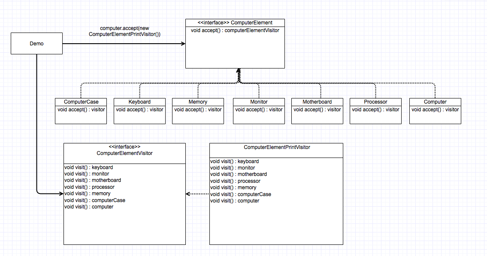

# visitor_design_pattern

#Intent

Represent an operation to be performed on the elements of an object structure.  Visitor lets you define a new operation without changing the classes of the elements on which it operates.

#Motivation

To address the problem of distributing all operations across different classes (which leads to a system that's hard to understand), Visitor handles this by adding each new operation separately to an independent class.

We can have both a packaging related operations from each class in a separate object, called a "visitor", and passing it to elements of the abstract syntax tree as it's transversed.

When an element "accepts" the visitor, it sends a request to the visitor that encodes the element's class.  The visitor will then execute the operation for that element -- the operation that used to be in the class of the lement.

#Applicability

Use the Visitor pattern when:

1) An object structure contains many classes of objects of differeing interfaces, and you want to perform operations on these objects that depend on their concrete classes.

2) Many distinct and unrelated operations need to be performed on objects in an object structure, and you want to avoid "polluting" their classes with these operations.

3) The classes defining the object structure rarely change, but you often want to define new operations over the structure.

#Problem solved in example

The Visitor pattern is used to separate a relatively complex set of structured data classes from the functionality that may be performed upon the data that they hold.  In this example, each ComputerElement needs the ability to print a basic command "Visiting (computer part)".  Rather than putting this code within each class, we create a ComputerElement interface (that all computer parts implement) that defines the method accept(ComputerElementVisitor).  ComputerElementVisitor is an interface that defines methods for each ComputerElement (ComputerCase, Keyboard, Monitor, etc).  We then have a concrete implementation of this class called ComputerElementPrintVisitor.  This class defines the actual functionality that each of the computer components does (the Sys with the computer part name).

Now, with each ComputerElement class having its data and functionality decoupled, we create a new ComputerElement, computer, in the demo class and are able to invoke the accept method passing the functionality we want done (ComputerElementPrintVisitor).

What this has done is decouple the data and functionality from the class, allowing us to add new complex functionality that each class must append without modifying the actual data classes themselves.

